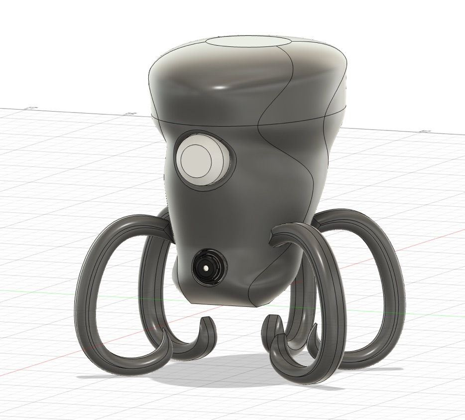
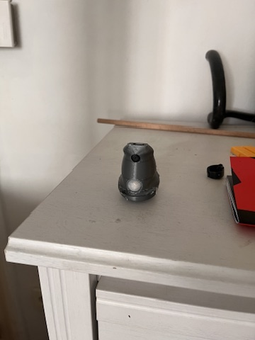
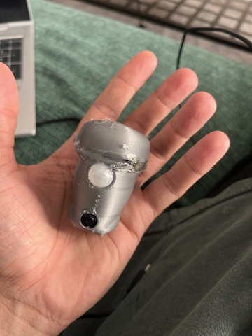
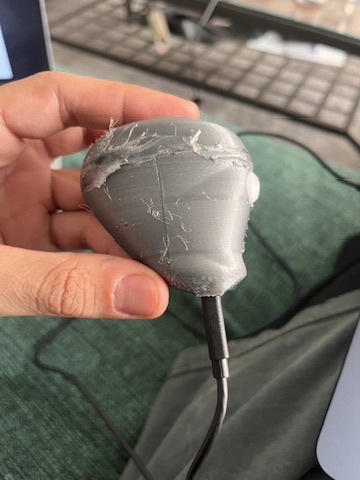
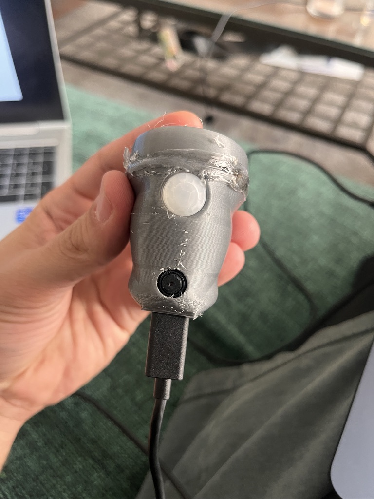

# Project Octopus

Battery-powered ESP32-S3 motion camera with Telegram alerts, custom enclosure design, and an evolving hardware/firmware prototype history.

<p align="center">
  
  
</p>

## Overview

Project Octopus is a small surveillance-style device built around a Seeed XIAO ESP32S3 camera board and a PIR motion sensor. The idea is simple:

- stay in a low-power state,
- wake when motion is detected,
- capture an image,
- send it through Telegram,
- live inside a distinctive 3D-printed enclosure that can keep evolving over time.

This repository collects the current firmware baseline, hardware references, and visual history from earlier prototype generations so we can start the next development cycle for `v5` from a cleaner foundation.

## Current Status

The checked-in firmware already proves the core concept, but it is still a prototype baseline rather than a polished product.

### Working today

- The board boots, reads battery voltage, initializes the camera, connects to Wi-Fi, and sends a Telegram message plus a captured photo.
- PIR input is configured and used as the intended wake source.
- The project builds with PlatformIO for the `seeed_xiao_esp32s3` target.

### Not finished yet

- Wi-Fi credentials and Telegram credentials are still hardcoded in source.
- The firmware currently restarts for debugging instead of entering deep sleep.
- Web-based configuration, filming mode, and remote control are still future work.
- The repository does not yet include automated tests.

> [!IMPORTANT]
> The current firmware stores secrets directly in `Firmware/src/main.cpp`. For `v5`, a safer configuration workflow should be one of the first cleanup tasks.

## Repository Layout

```text
Project_Octopus/
|- Firmware/
|  |- src/main.cpp              Main device flow
|  |- lib/camera/src/           Camera setup and Telegram upload logic
|  |- platformio.ini            PlatformIO environment and dependencies
|  |- include/                  Reserved for shared headers
|  `- test/                     Placeholder for future firmware tests
|- Hardware/
|  `- references/               Wiring, pinout, and programming reference images
|- docs/
|  |- v0/ ... v4/               Historical prototype snapshots
|  `- *.jpeg / *.png            Latest loose renders and prototype photos
`- README.md                    Project overview and onboarding
```

## Hardware Snapshot

Current hardware direction:

- Seeed XIAO ESP32S3 camera board
- PIR motion sensor
- Battery power with hardware on/off switch
- 3D-printed enclosure
- Battery voltage monitoring through a resistor divider to `A0`

The repo also includes useful hardware references:

- [ESP-CAM pin reference](Hardware/references/esp-cam-pin.png)
- [PIR sensor reference](Hardware/references/PIR-sensor.png)
- [ESP-CAM programming reference](Hardware/references/hardware-program-espcam.png)

## Firmware Baseline

The current firmware lives in [`Firmware/`](Firmware/) and is organized around two main files:

- [`Firmware/src/main.cpp`](Firmware/src/main.cpp): startup flow, battery reading, Wi-Fi connection, Telegram notifications, PIR handling, and sleep/restart behavior
- [`Firmware/lib/camera/src/camera.cpp`](Firmware/lib/camera/src/camera.cpp): camera initialization and photo upload to the Telegram Bot API

### Current runtime flow

1. Boot the device.
2. Read battery voltage from `A0`.
3. Initialize the camera.
4. Connect to Wi-Fi.
5. Send a Telegram text notification.
6. Capture and upload a photo.
7. Wait for the PIR line to return low.
8. Configure wake on motion.
9. Restart instead of sleeping.

That last step is intentional for debugging right now, but it is one of the main items to restore properly for `v5`.

## Getting Started

### 1. Install the tooling

Recommended options:

- [PlatformIO IDE](https://platformio.org/platformio-ide) for VS Code
- [PlatformIO Core](https://platformio.org/install/cli) if you prefer the command line

This project targets:

- board: `seeed_xiao_esp32s3`
- framework: `arduino`

### 2. Create your Telegram bot

Use Telegram to obtain the required values:

- `@BotFather` to create a bot and get the bot token
- `@myidbot` or `@userinfobot` to get your chat ID

### 3. Configure local secrets

Edit [`Firmware/src/main.cpp`](Firmware/src/main.cpp) and replace the development values for:

- `ssid`
- `password`
- `chatId`
- `BOTtoken`

### 4. Build the firmware

From the `Firmware/` directory:

```bash
cd Firmware
pio run -e seeed_xiao_esp32s3
```

### 5. Upload to the board

```bash
cd Firmware
pio run -t upload -e seeed_xiao_esp32s3
```

### 6. Open the serial monitor

```bash
cd Firmware
pio device monitor -b 115200
```

## v5 Development Direction

The next version should focus on turning the current prototype into a maintainable platform. A practical `v5` checklist is:

- remove secrets from source control,
- restore real deep-sleep behavior,
- separate hardware-specific constants from application logic,
- define a cleaner configuration story,
- document wiring and assembly more explicitly,
- add at least a small smoke-test strategy for firmware changes.

## Latest Prototype Gallery

The loose images directly under [`docs/`](docs/) represent the most recent enclosure direction and should stay visible at the top level of the project story.

### CAD and concept renders

<p align="center">
  
  
</p>

### Current printed prototype

<p align="center">
  
  
  
  
</p>

These images are useful as the visual reference point for the `v5` redesign because they show both the enclosure intent and the current assembly quality that still needs refinement.

## Prototype History

Past versions are archived in [`docs/`](docs/) by generation:

- [`docs/v0/`](docs/v0/): exposed electronics and early proof-of-concept wiring
- [`docs/v1/`](docs/v1/): first wall-mounted ESP-CAM and PIR assembly
- [`docs/v2/`](docs/v2/): boxed prototype with visible sensor and camera placement
- [`docs/v3/`](docs/v3/): octopus enclosure exploration, internal fit studies, and design analysis
- [`docs/v4/`](docs/v4/): latest compact enclosure and additional refinement snapshots

The shared 3D model link currently stored in [`docs/README`](docs/README) is:

- [Autodesk Viewer / model link](https://a360.co/4iRKNNP)

## References

Technical references that informed the prototype:

- [Random Nerd Tutorials: ESP32-CAM send photo to Telegram](https://randomnerdtutorials.com/telegram-esp32-cam-photo-arduino/)
- [Random Nerd Tutorials: ESP32-CAM shield and Telegram example](https://randomnerdtutorials.com/esp32-cam-shield-pcb-telegram/)
- [Brian Lough / Universal Arduino Telegram Bot](https://github.com/witnessmenow/Universal-Arduino-Telegram-Bot)

## Notes

- The current README is written to support the transition into `v5`, not to preserve every historical experiment in equal detail.
- If we continue organizing the repo, the next good step will be separating stable assets from archive material and introducing a proper configuration strategy for firmware secrets.
